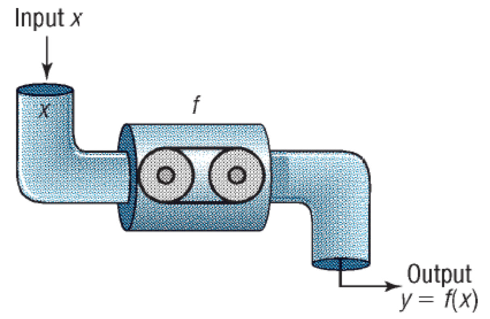

# DATA 127

## Part 0:  What is a function? (Week 1)

### What is a function?
	1. A rule that uses an input to get an output.  
	

	2. Usually a formula or a procedure -- every time I put the same input into the formula or procedure, I get the same output.

## Part 1:  Derivative Machine (Week 2-4)

### Slope of a straight line (Week 2, Tuesday)

1. $\frac{rise}{run} = \frac{\Delta x}{\Delta y}$

	- show positive slope, negative slope and zero slope (flat)
	- Practice: a line on a graph and ask them to find the slope
 	- remind them of $y = mx + b $

2. Relate to a real variable:  
	1. Examples:  
		- slope of a ski hill:  x = distance, y=height, slope=steepness of hill
		- x = number of cookie boxes sold, y = total sales in dollars, slope= price per box of cookies 
		- x = gallons of gas, y = distance a car can travel, slope = gas mileage
	2. Rate examples:  if the x-axis variable is time, we call the slope a rate
	 	- x = time, y=position, slope= rate of change of distance (speed) (miles per hour)
		- x = time, y=velocity, slope = rate of change of speed (acceleration)
		- x = time (minutes), y = number of blinks, slope = rate of blinking
		- x = hours, y = payment in dollars, slope = rate of earnings ($12.50/hr)

### Slope at a single point (Week 2, Thursday)

1. What if the function is not a straight line?  

	- the slope is changing
	- need to consider the idea of slope at a single point
	- Introduce idea of tangent line:  (draw a curve and mark a point, pick a point far away, calculate rise over run, and draw the slope.  Move the point closer and repeat.  Move the point closer again and repeat...then move the point on top of the original point and draw the tangent line)
	-  What is the slope of the tangent line?  Can't calculate slope using rise/run from a single point, but we have a "machine" that does.  Called a **derivative**
	- We'll learn how the machine works, but first let's learn how to use the derivative to find the slope at a point

### Derivative rules  (Week 3)

	- $$ x^n $$ rule
	- special derivatives to memorize (sin(x), cos(x), $e^x$, ln(x), log(x)
	- chain rule
	- product rule and special case of product rule (quotient rule)
	- linear combinations of these rules

### Introduce Limits to explain why the machine works the way it does (Week 4)
      
	

